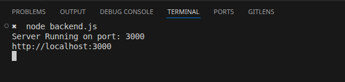
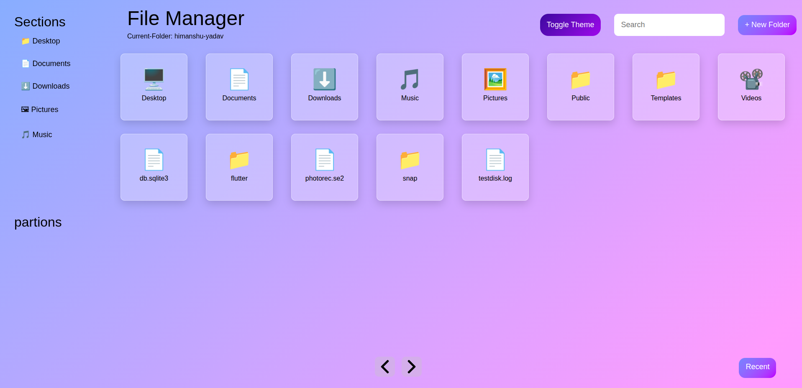
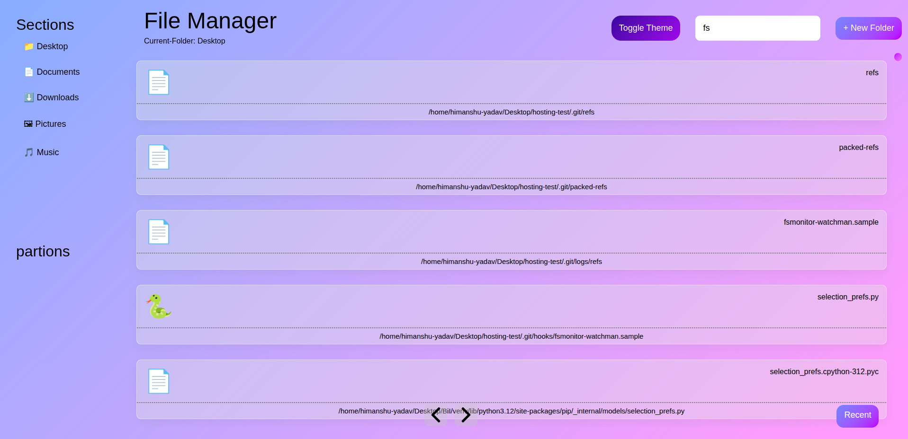
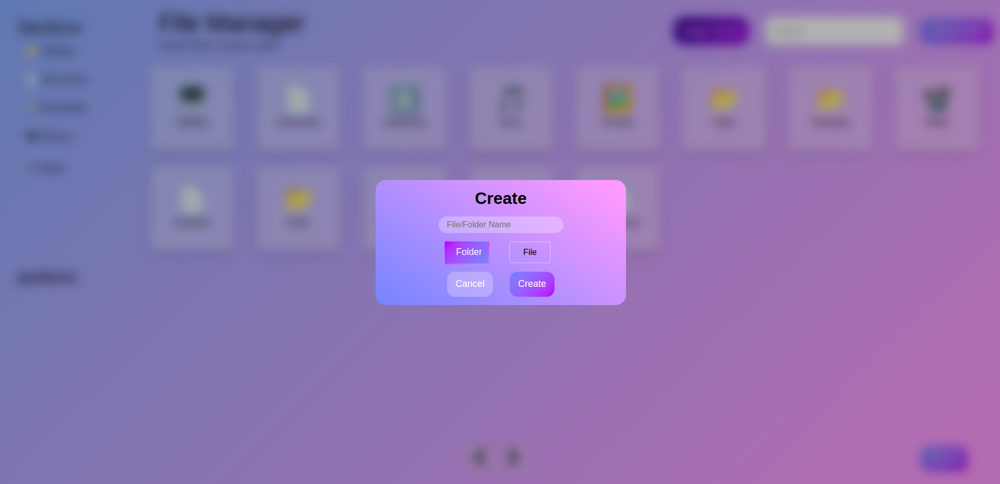

# 📁 File System Viewer

A simple web-based file system project that allows users to **view, open, create, and search files** from their computer using **plain HTML, CSS, and JavaScript** on the frontend, with a **Node.js backend** to interact with the local file system.

> ⚠️ This is a basic learning project and does not include delete functionality or advanced features.

---

## Preview

- Backend Running



- Frontend Preview



- Search Preview



- File Creation


##  Features

- 📂 View files from the local system  
- 📄 Open and read files  
- ✏️ Create new files and folders 
- 🔍 Search for files  
- 🖥️ Simple UI built using **Vanilla JavaScript** (no frameworks)

---

##  Tech Stack

### Frontend
- HTML5  
- CSS3  
- JavaScript (Vanilla)

### Backend
- Node.js  
- Express.js  

---

##  Project Structure

```
File-System/
│
├── testing			  # Things I took inspiration from
├── backend.js        # Server-side file system logic
├── index.html        # Main UI
├── style.css         # Styling
├── script.js         # Frontend logic
├── package.json      # Dependencies
└── README.md         # Project documentation
```

---

##  Installation & Setup

### 1. Clone the Repository
```bash
git clone https://github.com/MATRUNI/File-System.git
cd File-System
```
### 2. Intall Dependencies
```
npm install
```
### 3. Start the Server
```
node backend.js
```
### 4. Run the Application
```
index.html
```
---
##  Project Scope & Limitations

 ❌ No delete file functionality
    
❌ No authentication or permissions
    
❌ No frontend frameworks
    
 ❌ Basic UI (functionality-focused)

### This project is intended for learning and practice purposes.
---
##  What I Learned

-   Node.js file system operations
    
-   Connecting frontend JavaScript to a backend server
    
-   Handling file read, create, and search operations
    
-   Building applications using pure JavaScript
    

----------

##  Future Improvements

-   Add delete functionality
    
-   Improve UI/UX
    
-   Add access control
    

----------

##  Author

**MATRUNI**  
GitHub: https://github.com/MATRUNI

---
## License

This project is open-source and intended for educational use.
